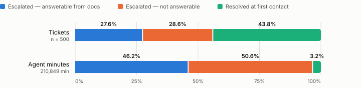

# An intelligent support system for CloudServe Solutions

**Kshitiz Bhargava**  
Forward Deployed AI Engineering — Capstone Report  
September 2026

---

## Abbreviations

| Abbreviation | Meaning |
|---|---|
| A1–A12 | The twelve pass/fail acceptance criteria of the Build Specification |
| API | Application programming interface |
| AS-nn | An assumption registered in the PRD before any code was written |
| D-nn | A decision in the decision record (Appendix G) |
| ECE | Expected calibration error |
| FCR | First-contact resolution |
| FR-nn | A functional requirement in the PRD |
| HTTP | Hypertext Transfer Protocol |
| k-NN | k-nearest-neighbour classifier |
| p95 | 95th percentile |
| PRD | Product requirements document (Appendix B) |
| R-nn | A risk in the risk register (Table 10, Appendix F) |
| WN-nn | A "will not" item: scope the PRD deliberately excludes |

## 1. Executive summary

CloudServe Solutions asked for a chatbot. Their support function receives over
500 tickets a week, replies in 8–12 hours against a two-hour commitment, and
resolves 43.8% on first contact.

**They do not have an answer shortage. They have a delivery failure.** 71.4% of
incoming tickets are already answered somewhere in their own twenty-nine
knowledge base articles, but their internal search matches article titles and
customers describe symptoms. Agents therefore answer from memory and escalate
when unsure rather than when the work is hard — with the result that **49.1% of
everything reaching a senior engineer is a question the documentation already
answered**, and those escalations consume **96.8% of all agent time**.

What was built is not a chatbot. It is a retrieval-grounded triage system that
finds the existing answer, sends it only when four independent conditions agree,
and otherwise hands the ticket to a person with the relevant article attached and
an honest statement of what it was uncertain about.

**What it achieved**, on the 80-ticket validation set, unattended, no degradation.
**Two independent cold runs** were made — `evaluation/results/2026-09-10-gate-run-1/`
and `-2/` — and both are committed, because on one measure they disagree about
whether a target is met. Headline figures are run 2, the later and the one with
correct guardrail accounting; run 1 is shown beside them as the honest measure of
run-to-run variance (Table 1).

*Table 1 — Headline results against the brief's targets: validation set, 80 tickets, two independent cold runs.*

| | Target | Run 2 | Run 1 | |
|---|---|---|---|---|
| **Deny-listed tickets auto-answered** | **0** | **0** | **0** | ✅ |
| Citation resolution | 100% | **100%** | **100%** | ✅ |
| Decision log reconciliation | exact | **passes** 80/80 | **passes** 80/80 | ✅ |
| Classification accuracy | ≥ 85% | **85.0%** | **87.5%** | ✅ *both* |
| Retrieval hit rate @3 | — | 94.3% | 94.3% | — |
| Processing latency p95 (net) | < 3s | **2.66s** | 3.08s | ⚠️ *straddles* |
| First contact resolution | ≥ 60% | 56.3% | 53.8% | ❌ |
| Escalation rate | ≤ 30% | 43.8% | 46.3% | ❌ *unreachable — below* |
| Fairness deviation | within 5pt | −38.1pt | −38.1pt | ❌ |

**The latency target sits inside the run-to-run variance, and I am not going to
report only the run that passes it.** Net of the free tier's rate-limit waiting
the p95 is 2.66s in run 2 and 3.08s in run 1 — the 3-second target falls between
them. The honest statement is that this system is *at* its latency budget, not
comfortably inside it. Raw p95, including the waiting, is 10.5s; 73% of measured
per-ticket time was the client asleep waiting for tokens it had not been given.

**Three targets missed.** Escalation is unreachable by construction and was known
to be on day zero. First-contact resolution of 56.3% sits **3.75 points** under
validation's own label ceiling of 60.0% — a real gap, and much smaller than the
comparison against 60% suggests. The fairness condition is exceeded, and §8.3 is
careful about what that does and does not establish.

**Classification accuracy clears its target in both runs**, at 85.0% and 87.5% —
but run 2 clears it by 0.0 points, which is not a margin. Treat the target as met
and the headroom as absent.

**The single most important caveat.** The escalation target of ≤30% is
unreachable without a governance breach, and this was established from the labels
on day zero rather than discovered as an excuse afterwards. Maximum *defensible*
automation on the development set is 65.2%, giving an escalation floor of 34.8%;
the built system reaches 64.0% / 36.0% at its shipped configuration, within 1.2
points of that prediction. On
validation the ceiling is lower still. Reaching 30% would require auto-answering
either security and compliance tickets or ungrounded ones. I chose to miss the
target and explain it.

---

## 2. The problem

CloudServe asked for a chatbot (Forward Deployed AI Engineering, 2026e). I spent the first day trying to work out whether
that was the right thing to build, and I don't think it is — not because a chatbot
is a bad idea, but because it answers a question nobody at CloudServe actually
asked.

A chatbot is a delivery mechanism. It describes how an answer reaches a customer.
It says nothing about where the answer comes from, whether it is right, what
happens when there isn't one, or who is accountable when it's wrong. Those are
the four things that decide whether this helps anyone, and none of them are
settled by choosing a conversational interface.

So I went looking for what is actually going wrong, and the data says something
fairly specific. CloudServe does not have an answer shortage. **71.4% of their
tickets are already answered in their own twenty-nine articles.** The answers
exist. They have been written, reviewed and published. What fails is the step
between a customer describing a symptom and the article that resolves it.

Ines, who writes the documentation, handed me the whole design brief in one
sentence without seeming to realise it:

> "Someone writes *my deployment keeps dying* and my article is called
> *resolving container health check failures*. There is no path between those two
> phrases in a keyword search."

That is the problem. Not a missing chatbot — a missing path between two ways of
describing the same thing. And it is the kind of problem semantic retrieval is
built to solve, which is why the system I built retrieves first and generates
second, rather than the other way round.

**What that failure costs is bigger than I expected.** Escalated tickets are
56.2% of volume but eat **96.8% of all agent minutes**. Worse, **46.2% of every
hour CloudServe's agents work goes to escalations the documentation already
answers.** Nearly half the support function's time is spent rediscovering things
that were already written down. Marcus, the Head of Support, owns these numbers and has never seen that
breakdown; when I asked him for one he said he would be guessing. He was not being
evasive. The composition of the escalation rate is simply not something his
reporting shows him.

The other thing that surprised me is who is worst served. Marcus is worried that
automation might give enterprise customers a worse experience and that they would
notice. Ravi, on the business plan, assumed enterprise customers already get
replies in about an hour. **Both are wrong in the same direction.** Enterprise is
the *slowest* tier at a 369-minute median, against 141 for business, and has the
lowest first-contact resolution at 37.3%. The fairness problem Marcus is guarding
against has already happened, and it happened in reverse.

So the brief I actually worked to is narrower and more awkward than "build a
chatbot":

Cut the number of tickets that need a person at all. When a person is still
needed, make sure the ticket arrives with the relevant article, a draft, and an
honest note about what the system was unsure of — rather than as a bare forward.
And never, under any circumstance, auto-answer something that should have gone to
a human, because the whole thing is worthless if it cannot be trusted on the
cases that matter.

That last point is why escalation is designed as an *output* of this system, not
as its failure branch. An escalation that arrives with the right page attached is
a good outcome. I would rather ship something that hands over cleanly 40% of the
time than something that answers everything and is wrong occasionally in ways
nobody catches.

One consequence of this framing is uncomfortable and I want it stated here rather
than buried in §7: **the escalation target of ≤30% cannot be met without breaking
the safety rules.** I worked that out on day one from the labels, not afterwards
as an excuse. §7.4 shows the arithmetic. I decided to miss the target and explain
why, instead of hitting it by auto-answering things that should not be
auto-answered.

---

## 3. Discovery findings

Five stakeholder interviews (Forward Deployed AI Engineering, 2026f) and 580 labelled tickets (Forward Deployed AI Engineering, 2026b). Every figure below was
computed from the data rather than taken from the pack's summary tables; the
scripts are in `scripts/` and the saved outputs in `evaluation/results/`.

### 3.1 The answers already exist — the search does not reach them

**71.4%** of development tickets are answerable from the existing twenty-nine
articles. Sofia, the tier-one agent, estimated "seven out of ten" from
experience; she was right to within a point.

Ines, who wrote the articles, supplied the mechanism without recognising it as
the central finding:

> "Someone writes *my deployment keeps dying* and my article is called
> *resolving container health check failures*. There is no path between those two
> phrases in a keyword search."

That sentence is the design brief. Semantic retrieval is exactly the path between
those two phrases, and it works. On ranking alone, an expected document is in the
top three for **95.2%** of the 357 groundable development tickets. At the
relevance floor of **0.40** that actually ships — which exists so the system
returns *nothing* rather than something irrelevant — it is **92.7%**. The second
number is the one the built system delivers
(`evaluation/results/2026-09-04-retrieval-tuning.txt`).

### 3.2 Half of all escalations were already answered — and the Head of Support cannot see it

Daniel, tier two, said about half of what reaches him could have been resolved at
tier one. The data settles it: of 281 historically escalated tickets, **138
(49.1%)** are answerable from documentation, and **92 (32.7%)** are labelled as
tickets that should have been auto-answered.

Marcus, who owns the numbers, never mentions this. He sees the escalation rate,
not its composition — and he said so: *"If you asked me for a breakdown I would be
guessing."*

**The cost of that blind spot is the largest number in this report.** Escalated
tickets are 56.2% of volume but consume **96.8% of all agent minutes**, and
**46.2% of every hour worked went to escalations the documentation already
answered** (Figure 1). The split is computed by `scripts/analyse_agent_time.py`,
which draws the figure from the same pass (`evaluation/results/2026-09-14-agent-time.txt`).



*Figure 1 — Where agent time goes, development set (500 tickets, 210,849 agent minutes). Share of tickets: escalated and answerable from the documentation 27.6%, escalated and not answerable 28.6%, resolved at first contact 43.8%. Share of agent minutes: escalated and answerable 46.2%, escalated and not answerable 50.6%, resolved at first contact 3.2%. Source fields: `history.escalated`, `history.resolution_time_minutes`, `labels.answerable_from_docs`.*

### 3.3 Enterprise customers are the worst served, and everyone believes the opposite

Marcus feared enterprise customers would notice if they got worse service. Ravi,
a business-plan customer, believed an enterprise colleague got replies in about
an hour and worried the gap would widen.

Both are wrong, in the same direction (Table 2):

*Table 2 — Median resolution time and first-contact resolution by customer tier, development set.*

| Tier | Median resolution | First contact resolution |
|---|---|---|
| Business | **141 min** | 48.2% |
| Standard | 266 min | 43.1% |
| **Enterprise** | **369 min** | **37.3%** |

Enterprise is already the slowest and least-resolved tier. The fairness risk
Marcus is guarding against has already happened, in reverse, and it is a renewal
risk today rather than a future one.

### 3.4 Two findings about the data itself

**The evaluation data is templated.** 57% of development ticket bodies duplicate
another ticket verbatim, and same-intent vocabulary overlap is 19× cross-intent.
A k-nearest-neighbour classifier over embeddings scores **99.4%** leave-one-out
against an 85% target — which measures template regularity, not capability. That
classifier was deliberately not shipped. Every accuracy figure in this report
describes performance on synthetic, templated data, and any claim beyond that is
an extrapolation.

**Development and validation diverge on five separate measures**, sometimes
inverting. Non-fluent English tickets are labelled slightly *better* than fluent
on development and 23.5 points *worse* on validation. `asia_pacific` is the
lowest-served region on development and the highest on validation. This shaped
the fairness method (§8.3) and every generalisation in this report is qualified
by it.

---

## 4. Requirements

Twenty-five functional and eight non-functional requirements, each traced to a
numbered discovery finding. PRD v1.0 was written on day one, **before any code**,
specifically so the compulsory revision in §9 would have a genuine trigger.

Table 3 shows selected requirements and the evidence each traces to. The Build Specification's twelve pass/fail acceptance criteria (Forward Deployed AI Engineering, 2026a) are referred to as A1–A12 throughout; A9, the one the assessment turns on, is a single documented command that processes a whole ticket file unattended.

*Table 3 — Selected functional requirements and their discovery evidence.*

| ID | Requirement | Evidence |
|---|---|---|
| FR-06 | Retrieve ranked passages with resolvable document ids | §3.1 — Ines on the search gap |
| FR-07 | Return **nothing** when nothing clears the relevance floor | §3.4 — 28.6% of tickets have no supporting article |
| FR-10 | Never auto-answer security, compliance, feature-request or unclear tickets | Daniel and Marcus; 87/500 tickets, zero label violations |
| FR-13 | State plainly when the answer is not known | Marcus: *"I would rather it said nothing than said something wrong"* |
| FR-16 | Every escalation carries the draft, the sources, and what the system was unsure about | Daniel: *"I do not need it to be right. I need it to show its working"* |
| FR-23 | Disclose that the reply was automated | Ravi: *"I calibrate how much I trust it. Hiding that would be the thing that annoys me"* |

**Deliberately out of scope:** a conversational chatbot; learning from agents'
unreviewed private answer files (Daniel: *"you will scale up a mistake"*); writing
to the knowledge base (Ines owns editorial control); translation.

The full traceability chain — requirement → prompt → implementation → test — is
in the Stage 3 workbook, generated against the code. It names five requirements
that are implemented and tested but untagged in source.

---

## 5. Architecture and design

Six components in sequence, built as a LangGraph state machine (LangChain, 2025). Retrieval and generation follow the retrieval-augmented generation pattern (Lewis et al., 2020), with routing and validation between them:

```
ingest → classify → retrieve → route → generate → validate
```

### 5.1 The decision that shapes everything: routing is a conjunction

Auto-responding requires **four independent conditions to agree**: a confidence
margin above threshold, an intent not on the deny-list, a retrieved passage above
the relevance floor, and grounding validated. Any single failure escalates.

Measured over 200 development tickets, the conjuncts are **not** equal (Table 4):

*Table 4 — Share of escalations in which each routing condition failed, 200 development tickets. A ticket can fail more than one condition, so the shares sum past 100%.*

| Conjunct | Share of escalations |
|---|---|
| deny-list | 54% |
| lexical screen | 50% |
| alternatives | 36% |
| **margin (confidence)** | **29%** |
| grounded | 14% |

The confidence threshold — the thing most such systems are built around — turned
out to be the weakest leg. §9 explains how that was discovered.

### 5.2 Citations are constructed, not written

The model is given numbered passages and cites positions — `[1]`, `[2]` — which
the code maps back to the `chunk_id` and `doc_id` that produced them. **The model
never writes a document identifier, so it cannot invent one.**

This makes citation accuracy structural rather than prompt-dependent. An
out-of-range marker is arithmetic; a plausible-looking document name would be a
judgement call. The Build Specification names "citations generated as
plausible-looking references" as a failure mode; this design makes it
unreachable.

### 5.3 Escalation is a designed output

An escalation carries the drafted answer, the retrieved sources with scores, the
predicted intent with alternatives, the urgency as a priority, and a plain
statement of what the system was unsure about. That is Daniel's stated
requirement, and it is what converts escalation from a loss into a product
feature.

### 5.4 Alternatives considered

Table 5 lists the alternatives considered and why each was rejected.

*Table 5 — Alternatives considered, and why each was not shipped.*

| Alternative | Why not |
|---|---|
| k-NN classifier over ticket embeddings (99.4%) | Memorises templates. Would score brilliantly on the hidden set and generalise to nothing |
| Automatically derived safety vocabulary (90.8% held-out vs 73.6%) | Contains `only`, `call`, `nobody` — generic words correlating with deny-list templates. A security control that fires on the word "only" is not defensible |
| Whole-corpus prompting (the corpus is only ~8k tokens) | Would satisfy no retrieval criterion and produce no resolvable citations |
| Section-level chunking | Measured: 92.7% any-hit against 95.2% for whole documents — both at floor 0.00, so the comparison is like for like — and more complex |
| FastAPI service (the Brief's recommended interface) | None of the twelve acceptance criteria needs an HTTP endpoint. A9 asks for one documented command, a file in and a file out, and the Build Specification calls its own `python -m src.api` example "illustrative rather than prescriptive". The harness and `scripts/demo.py` show more than an endpoint would, and a service surface would have added code, tests and setup steps that carry no marks. A live integration is also out of scope (PRD WN-05) |
| Prometheus and Grafana monitoring (the Brief's recommended monitoring) | Monitoring is not an acceptance criterion. Every figure a dashboard would show (volume by outcome, latency percentiles, guardrail activations, confidence distribution) is already computed by the harness report, which is what A10 requires. A dashboard would have been a second view of the same numbers, and a second place for them to disagree. Cut on day one (Stage 4 Sprint Plan, §5) |

---

## 6. Implementation

516 tests, 92% statement-and-branch coverage (91.7%) over `src/` and `evaluation/`
(92% over `src/` alone), one command (`pytest`), green on a clean checkout
without an API key.

**What was difficult** — in each case the defect was invisible until the whole
pipeline ran at volume:

1. **The provider is not deterministic at temperature 0.** 1 of 20 intents and 3
   of 20 confidences differ across identical inputs. A5 requires the same ticket
   to produce the same decision twice, so **the content-addressed cache is what
   satisfies that criterion**, not the model.
2. **A reasoning model bills its thinking against `max_tokens`.** With a 200-token
   budget, harder tickets spent it all reasoning and returned HTTP 200 with empty
   content — which was being cached as success, making one truncation permanent.
3. **Two rate-limit defects, then a third limit nobody documents.** The provider's
   `reset` header is time-until-full and the bucket refills continuously; sleeping
   the whole window to buy a few hundred tokens took the first gate run to 25
   tickets in 90 minutes. Fixing that revealed a **200,000 tokens/day cap that
   appears only in the 429 body** — every rate-limit header describes the
   per-minute bucket, which was full.
4. **Catching exceptions only at the top of the graph was not enough.** A
   classification failure aborted the pipeline and therefore also lost retrieval —
   so the retrieval-only fallback arrived without the documentation it exists to
   attach. Each node is now contained separately.

**What I would restructure.** The pacing logic accumulated three fixes and should
be one component with a single owner of "how many tokens may I spend now". And
the harness grew report-generation, health checks and orchestration in one file;
the report builder is already pure and should be separated properly.

---

## 7. Evaluation

### 7.1 Method

Development set (500) for all development and threshold derivation. Validation
(80) held back, following the Project Brief's instruction rather than the Dataset
Guide's looser wording — a conflict named here because the two documents
disagree.

**No hidden set was supplied, so none was run.** The pack's `05_Datasets/` holds
the development, validation, documentation and ground-truth data files, together
with the dataset guide and the interview transcripts; the hidden
set is processed by the assessors on their own machine. The Submission Guide's checklist (Forward Deployed AI Engineering, 2026g) asks that the hidden set be used once and that the report say when. The
honest answer is that it could not be used here. The closest held-back split was
validation, and it was used six times rather than once — every use is listed
below.

**Six runs touched the validation set, and all six are listed** in
[`docs/validation-runs.md`](../validation-runs.md) with their run_id, timestamp,
duration, token cost and artifact. Four were cold runs — two lost to the provider,
two healthy and both committed — and two were cache replays that made no provider
calls, spent no tokens, and existed only to confirm that a code change had not
moved run 4's counts.

An earlier draft of this sentence said the runs were "logged". They were, in
`storage/decisions.db`, but no reader could check that without writing a SQL
query, and a discipline claim you cannot verify is not one. `scripts/list_runs.py`
now prints the log and the document above records what each run was for. Six runs
against an 80-ticket set is more than "a small number" implies; the defence is
that no parameter was derived from any of them, and §8.3's one validation finding
is explicitly not acted on.

Every threshold was derived by sweep, not chosen. Evidence files carry a
provenance banner naming the commit, model and all three thresholds they were
produced under.

### 7.2 Results

Table 6 gives the full results for both runs.

*Table 6 — Evaluation results against every target, validation set (80 tickets). Two independent cold runs, both committed:
`evaluation/results/2026-09-10-gate-run-2/` (headline) and `-1/`. Neither
degraded: `degraded: false`, `classification_fallback_rate: 0.0`,
`cache_replay: false`, no quota exhaustion.*

| Measure | Baseline | Target | Run 2 | Run 1 |
|---|---|---|---|---|
| First contact resolution | 43.8% | ≥60% | 56.3% ❌ | 53.8% ❌ |
| Escalation rate | 56.2% | ≤30% | 43.8% ❌ | 46.3% ❌ |
| Classification accuracy | — | ≥85% | **85.0%** ✅ | **87.5%** ✅ |
| Retrieval hit rate @3 | — | — | 94.3% | 94.3% |
| Citation resolution | — | 100% | **100%** ✅ | **100%** ✅ |
| Processing latency p95, net | 8–12 hrs | <3s | **2.66s** ✅ | 3.08s ❌ |
| Processing latency p95, raw | — | — | 10.51s | 11.32s |
| Deny-list violations | — | 0 | **0** ✅ | **0** ✅ |
| Decision log reconciliation | — | exact | **80/80** ✅ | **80/80** ✅ |
| Fairness deviation | — | within 5pt | −38.1pt ❌ | −38.1pt ❌ |

*Run 2 volume: 80 processed, 45 auto-answered, 35 escalated — of which **4 were
blocked by a guardrail** and 31 escalated before a draft existed.*

**Why two runs.** The first was made before a defect in guardrail accounting was
found (§8.2; decision D-47, Appendix G), so its `blocked_by_guardrails` count is wrong — it reported 0
where the true figure is 4. Its *rates* are unaffected by that defect, so rather
than discard it I kept it as a second observation. That turned out to matter: the
two runs disagree about the latency target.

**On latency, and why two figures per run.** Most of the measured per-ticket time
was the client asleep waiting for the free tier's token allowance — 330.1s of
450.6s (73.3%) in run 2, and 317.3s of 472.9s (67.1%) in run 1 — a property of an unpaid deployment, not of
the system. Both figures are reported because neither alone is honest: the raw
one describes what a user on this tier experiences, the net one describes the
system. **Net of waiting, p95 is 2.66s in run 2 and 3.08s in run 1**, so the
3-second target lies inside the run-to-run band. I report the target as met in
run 2 and missed in run 1 rather than picking one.

**Run-to-run variance, measured rather than asserted.** Across the two runs: FCR
53.8–56.3%, accuracy 85.0–87.5%, net p95 2.66–3.08s, auto-answered 43–45 of 80.
That is a ±1.25 point band on FCR and ±1.25 on accuracy, consistent with the
±1.5 points established on development (decision D-28, Appendix G). **No single-run difference
smaller than about 2.5 points should be read as a result**, which is the standard
this report tries to hold itself to elsewhere.

**What a run costs.** Run 2 needed 129 completions for 80 tickets — 80
classifications plus 49 generations (45 sent, 4 blocked) — at 651.5 tokens per
provider call, 76,224 tokens with 12 served from cache. Cold-equivalent that is
**84,042** tokens, against the preflight's estimate of **85,542** for 80 tickets:
**1.8% pessimistic**, which is the direction it is designed to err in but a much
narrower margin than it looks. The 12 cache hits are within-run duplicates — the
validation split contains repeated ticket bodies — and are disclosed here because
an undisclosed cache hit is how a throughput claim went wrong once already (decision D-30, Appendix G).

### 7.3 Calibration — a failed condition, reported as one

The governance condition is stated confidence within five points of observed
accuracy. Four cold runs of 100 tickets were made during development (Table 7):

*Table 7 — Classification accuracy and expected calibration error (ECE) across four 100-ticket cold runs.*

| Run | Accuracy | ECE | Within 5 points? | Artifact |
|---|---|---|---|---|
| 4 | **90.0%** | **2.6%** | yes | `2026-09-07-classifier-100-cold.txt` |
| 1–3 | 89 / 86 / 87% | 3.2 / 6.0 / 5.2% | 2 of 3 | **not committed** |

**Only the last run has a committed artifact**, and its figures are 90.0% / 2.6%
— not the 2.5% an earlier draft of this table reported for it. Runs 1–3 were made
before the evaluation scripts wrote provenance-stamped output files (decision D-37, Appendix G), so
their numbers survive only as notes and **cannot be checked**. They are shown
because the pattern across them is what drove a design decision, and suppressed
figures would misrepresent how that decision was reached — but a reader should
weight them accordingly, and the honest summary is: **one verifiable run passes;
the condition failed in at least one unverifiable run.**

The cause is specific and is visible in the committed artifact: the model is
overconfident in the 0.80–1.00 band, where 99 of 100 predictions land, so expected calibration error (ECE; Naeini, Cooper and Hauskrecht, 2015; Guo et al., 2017), which averages the gap between confidence and accuracy over confidence bins, is dominated by a single bin and moves several points between runs on a handful of
tickets.

This failure is also the justification for the architecture. Confidence fails
calibration, which is precisely why routing thresholds on *margin* rather than
confidence, and why §5.1's conjunction leans on grounding and the deny-list.

### 7.4 Why one target is missed on purpose

Maximum defensible automation on development is 311 tickets labelled
`auto_respond` plus 15 labelled `escalate` that are neither deny-listed nor
ungrounded — **326/500 = 65.2%**, giving an escalation floor of **34.8%**. The
built system reaches 64.0% / 36.0% at the shipped margin of 0.85.

Reaching 30% would require moving 39 more tickets, and the only pools available
are 87 deny-listed tickets (a governance failure) or 87 ungrounded ones (blocked
by the system's own grounding guardrail).

There is a reading under which both targets are achievable: the targets sum to 90
rather than 100, and the Build Specification counts "blocked by guardrails"
separately from "escalated". Under that reading, 60% answered + 30% escalated +
10% blocked satisfies both. **That reading is rejected by design choice**: every
guardrail routes to block *and* escalate, because a blocked response still leaves
a customer without an answer and a human who must write one. Hitting 30% under
the three-outcome reading would require **at least 24 of 120 hidden tickets to
end with no answer and no human assigned**. Blocked counts are reported
separately regardless, so a reader can recompute under either taxonomy: run 2 is
**45 answered / 31 escalated / 4 blocked**.

That promise was not kept until 10 September. The reporter printed
`blocked_by_guardrails: 0` for a run in which four drafts were generated and
withheld, because an ungrounded draft short-circuited past the validator entirely
— so the grounding guardrail had a branch no production path could reach, and its
activation count was structurally zero rather than observed to be zero (decision D-47, Appendix G).

### 7.5 The limits of what was measured

**The figures above should be treated with caution because:**

- **The data is templated.** 57% of development ticket bodies duplicate another
  ticket. Any classifier scores implausibly well; a naive k-NN reaches 99.4%.
  These figures describe synthetic data.
- **Development and validation diverge on five measures and sometimes invert**, so
  a development figure may be optimistic on the hidden set.
- **Accuracy varies ±2 points run to run** because the provider is not
  deterministic at temperature 0.
- **Repeat contacts cannot be measured at all.** Same-customer, same-intent within
  seven days yields 2 pairs in 500 tickets. Reporting a number would be
  fabrication.
- **Satisfaction is not measured.** No live customers exist. Not estimated.
- **Response time is processing latency, not wall-clock human response.** The
  schema has no `replied_at` field, so the Evaluation Framework's own sample code (Forward Deployed AI Engineering, 2026c)
  cannot be run. Comparing a sub-second pipeline to an 8-hour human queue needs
  that caveat to be honest.
- **Hallucination rate has not been established** to the Framework's standard of
  fifty responses and two assessors.

---

## 8. Governance and risk

### 8.1 Decision logging

Every stage writes the minimum record set by the Governance Framework (Forward Deployed AI Engineering, 2026d), including
`prompt_version` and `requirement_ids` — the two fields that answer *"was this
behaviour intended?"* after an incident. Reconciliation is by **identity in both
directions**, scoped to a run.

### 8.2 The safety gate, and a claim that was withdrawn

The design originally described "a deterministic deny-list that no confidence
score can override". **That was false and was retracted.** The deny-list keys on
the *predicted* intent, so a misclassified security incident never triggers it —
nothing is overridden, the rule simply does not fire. At the brief's own 85%
accuracy target that is roughly 3 tickets per 120, against a threshold of zero.

Three layers replaced it — predicted intent, an intent-agnostic lexical
pre-screen, and alternatives-aware abstention — plus a fourth, structural
protection: **56 of the 87 deny-listed development tickets cannot be grounded at
all**, so grounding protects them regardless of the classifier. Residual exposure
is confined to `security_incident` and `compliance_request` and is estimated at
~1 ticket in 120.

**Measured: zero deny-listed tickets auto-answered, at every threshold tested,
across every run including the degraded ones.**

**One guardrail was, however, structurally unable to fire.** The grounding check
withholds a draft whose citations do not resolve. The pipeline short-circuited
such drafts before the validator ran, so that branch was unreachable and the
report said zero blocks where four had occurred (decision D-47, Appendix G). The deny-list and
tone-and-scope guardrails were unaffected and the deny-list condition held
throughout — but the episode is worth stating plainly here rather than only in the
decision log, because **"this control never needed to fire" and "this control
could not fire" produce the same number**, and only one of them is good news.
Corrected, the run blocks 4 of 80.

### 8.3 Fairness

Measuring segments against each other would be wrong here. The **labels
themselves** already vary by more than the five-point condition (Table 8):

*Table 8 — Spread of the label baseline (the expected auto-respond rate) across segments, by split.*

| Segment | Dev label spread | Validation label spread |
|---|---|---|
| `customer_region` | **14.4pt** | **28.6pt** |
| `language_fluency` | 5.9pt | **23.5pt** |

Three of four segments exceed the condition before any system exists. The
ordering also inverts between splits. The audit therefore reports **system rate
minus the same split's label baseline**, pre-registered before results were
known. Segments below ten tickets carry a Wilson score interval (Wilson, 1927) and are labelled as
unable to support inference — a caveat that, until review, printed only when no
outcomes were supplied, so it was suppressed on exactly the delta rows most
likely to be quoted (`enterprise`, n=8; `latin_america`, n=7). It is now
unconditional.

**The result: the condition is exceeded, and no single segment survives testing** (Table 9).

*Table 9 — System auto-respond rate against each segment's label baseline, validation run 2, with the paired exact (McNemar) p-value and its Holm adjustment across all eleven segments tested. Source: `evaluation/results/2026-09-10-fairness-validation.txt`.*

| Segment | n | Baseline | System | Delta | Discordant | p | Holm |
|---|---|---|---|---|---|---|---|
| `asia_pacific` | 21 | 71.4% | 33.3% | **−38.1pt** | 10 / 2 | 0.039 | 0.424 |
| `north_america` | 27 | 51.9% | 66.7% | +14.8pt | 2 / 6 | 0.289 | 1.000 |
| `europe` | 25 | 64.0% | 76.0% | +12.0pt | 2 / 5 | 0.453 | 1.000 |
| `short` tickets | 44 | 65.9% | 54.5% | −11.4pt | 8 / 3 | 0.227 | 1.000 |
| `fluent` | 61 | 65.6% | 59.0% | −6.6pt | 12 / 8 | 0.503 | 1.000 |
| `long` tickets | 36 | 52.8% | 58.3% | +5.6pt | 8 / 10 | 0.815 | 1.000 |
| `non_fluent` | 19 | 42.1% | 47.4% | +5.3pt | 4 / 5 | 1.000 | 1.000 |
| `standard` | 42 | 50.0% | 45.2% | −4.8pt ✅ | 9 / 7 | 0.804 | 1.000 |
| `business` | 30 | 70.0% | 73.3% | +3.3pt ✅ | 5 / 6 | 1.000 | 1.000 |

`enterprise` (n=8) and `latin_america` (n=7) are printed by the tool, flagged, and
**excluded** from the verdict — a segment it declares too small to support an
inference must not be the number the report leads with.

**Verdict: EXCEEDED**, at −38.1 points against a five-point condition. Reported as
a failed condition, like calibration (§7.3), and not softened.

**But be precise about what that does and does not establish.** The condition is
stated in percentage points, and as measured it is missed. That is not the same
claim as "this segment is treated unfairly", and the table above is deliberately
built so the two cannot be confused:

- The system's decision and the label are made on **the same ticket**, so the two rates are paired and are compared with McNemar's exact test (McNemar, 1947). Only the discordant tickets carry information — for
  `business`, 30 tickets reduce to 5 disagreements each way, which is why
  **+3.3pt there is not evidence of agreement** any more than it is of bias.
- `asia_pacific` is the only segment with a raw p below 0.05 (0.039, from a 10/2
  split). **Eleven segments were tested at once.** After Holm correction (Holm, 1979) it is 0.424, and **nothing survives at 0.05.** Quoting the smallest of eleven p-values
  as a finding is precisely how a table like this manufactures one.
- So the honest reading of `europe +12.0` and `north_america +14.8` is *not* that
  those regions are favoured. p = 0.45 and 0.29. They are noise-consistent.

**What is nonetheless worth acting on, stated carefully.** The `asia_pacific` gap
is **identical in both independent cold runs** — −38.1 points, from the same 10/2
discordant split each time. I first wrote that this made it distinctive, "while
other segments moved by up to 3 points". That is false, and the validator caught
it: **six of the eleven segments are identical between the two runs**,
`asia_pacific` among them, and the largest movement is `north_america` at 7.4
points (`enterprise`, at n=8, moved 12.5). Stability is the norm here, not the
exception — both runs route the same 80 tickets and only a handful of decisions
differ — so reproducibility is much weaker evidence than I made it sound.

What is left is: the largest gap in the table, at the largest n of any exceeding
segment, stable across two runs, and **not surviving correction over eleven
comparisons**. That is a **lead**, not a result: the right response is to go and measure it properly on development
data, which §10.2 sets out, and not to publish it as a finding or to tune against
it. The Project Brief forbids tuning against validation, and the hidden set is
drawn from the same population.

**Sofia's hypothesis is not refuted; it is undetectable at this sample size.** She
believed non-fluent English tickets were handled worse. `non_fluent` measures
+5.3pt — nominally better than baseline — but on a 4/5 discordant split, p = 1.00.
Nineteen tickets cannot answer her question in either direction. An earlier draft
of this section said the run "contradicted" her, which overstated it: the correct
statement is that this run **cannot detect** the effect she describes, and that
saying so is different from saying she was wrong. Her concern is why this audit
exists, and it deserves the measurement §10.2 proposes rather than a dismissal
built on nineteen tickets.

### 8.4 The kill switch

`touch storage/KILL`. Checked once per ticket **before any model call**, effective
on the next ticket, no deployment. Tickets in flight complete as escalations.
Two tests: every ticket escalates, and **zero model calls are made**. It was moved
earlier in the pipeline during the build after a test showed classification had
already spent a call before the switch was checked.

### 8.5 Risk register

The full register — eleven risks, each with likelihood, impact, the mitigation
built into the design, and a named owner — is in the Governance Framework
(Appendix F, §2). Table 10 summarises the seven rated severe or worse, plus R-06,
which is rated only moderate in impact but High in likelihood: the provider
failed repeatedly during the build. The common thread is that every
mitigation is a property of the pipeline rather than a policy someone has to
remember.

*Table 10 — The seven risks rated severe or worse, and R-06, rated High likelihood, with the mitigation built into the design. Full register: Governance Framework §2.*

| ID | Risk | Likelihood / impact | Mitigation in the design |
|---|---|---|---|
| R-01 | Answers confidently and incorrectly | High / severe | Four conditions must all agree before sending; otherwise escalate with the draft and what was uncertain |
| R-02 | Private data in an outbound response | Medium / unacceptable at any rate | Guardrail blocks and escalates; a response is never redacted and sent |
| R-03 | Customer input treated as an instruction | Medium / severe | Ticket text travels as a separate message, never inside the instructions; an integrity guardrail checks independently |
| R-04 | Some customer groups served worse | High / severe at renewal | Every segment measured against its own split's label baseline; the audit refuses degraded runs |
| R-06 | Model provider unavailable | High / moderate if handled | Degrades to retrieval-only and completes; the report is flagged and business rates withheld |
| R-09 | Security or compliance ticket auto-answered | Medium / severe, non-recoverable | Three independent layers plus grounding (§8.2) |
| R-10 | A broken run mistaken for a cautious one | Medium / severe — corrupts the evaluation | Degraded flag and a distribution-collapse alarm, both checked before any rate is published |
| R-11 | Agents stop checking the system's drafts | Medium / severe, slow to notice | Automated replies say so; escalations state what the system was unsure about |

### 8.6 Incident procedure

The procedure is written so that someone unfamiliar with the system could follow
it at two in the morning. Table 11 gives the six steps; owners and time limits for
each are in the Governance Framework (Appendix F, §5).

*Table 11 — The six-step incident procedure.*

| Step | What happens |
|---|---|
| 1. Detect | A customer reports a wrong or harmful reply, a private-data or instruction-integrity block appears, escalation jumps above 60% in a run, or a run reports degraded unexpectedly |
| 2. Contain | `touch storage/KILL` — every later ticket escalates with no model call, in under a minute, with no deployment |
| 3. Assess | Look the ticket up in the decision log: intent, alternatives, passages and scores, thresholds, every guardrail result and the prompt version |
| 4. Notify | Contact an affected customer directly; if private data was disclosed, notify the customer and the data owner the same day; if a security or compliance ticket was auto-answered, escalate to the Head of Support immediately |
| 5. Remediate | Match the cause to the control — the article, the grounding check, or a missing safety marker — re-measure the control that failed, and release the kill switch only once a test reproduces the incident and passes |
| 6. Review | Record which control should have caught it and why it did not, and add the incident to `docs/DECISIONS.md` within a week |

---

## 9. The requirements revision

Eight changes, each with a dated trigger. The largest:

**Assumption AS-02 in the PRD failed.** PRD v1 assumed classifier confidence was calibrated enough to
threshold on. Measurement put **99 of 100 predictions in a single band** — there
is no curve to pick a point on. The routing basis moved to the *margin* between
the top intent and the best alternative, which has a real precision/coverage
curve. Confidence is now used only to report calibration.

**The safety gate claim was withdrawn** (§8.2), and the conjunction was
explicitly **ranked** rather than presented as four equals.

**The fairness baseline became split-dependent** after the orderings were found to
invert.

**What was deliberately not changed:** the escalation target was not chased; the
99.4% k-NN was not shipped; the higher-scoring derived vocabulary was not shipped;
and nothing was tuned against validation after the gate missed its target.

Full log with triggers and dates: Stage 5 workbook.

---

## 10. Conclusions

### 10.1 What was delivered

A system that clears the gate — 80 tickets, one command, unattended, no
degradation, zero deny-list violations, a reconciling decision log, and a
per-ticket audit trail for all 80.

**Three of eight targets are missed**, and the report says so in its first table
rather than its last. The escalation rate is unreachable by construction and was
known to be on day zero. First-contact resolution of 56.3% sits **3.75 points**
below validation's own label ceiling of 60.0% — a real gap, and much smaller than
the comparison against the 60% target suggests. A fourth, the sub-3-second
latency target, is **met in one cold run (2.66s) and missed in the other (3.08s)**;
both are committed, and I report it as straddling rather than picking the run that
passes.

**The fairness condition is exceeded, and §8.3 is careful about what that
establishes.** The system auto-answers 33.3% of `asia_pacific` tickets where the
labels say 71.4% are answerable — a −38.1 point deviation against a five-point
condition, the largest gap in the table at the largest n of any segment that
exceeds. It is **not** established as a finding: eleven segments were tested, and
after Holm correction nothing survives at 0.05 (`asia_pacific` adjusts from 0.039
to 0.424). It is a lead to investigate on development data, not a result to
publish, and §10.2 says what to measure.

**Every target in the brief, in one place.** Table 12 collects them — business,
technical and governance — with what the system achieved and where it did not.
Six are met, three are missed, one straddles the run-to-run band, and four could
not be measured at all with the data supplied. Saying which is which is the point
of the table: a
target that was never measurable is a different thing from one that was measured
and missed, and collapsing the two would flatter this result.

*Table 12 — Every measure in Project Brief §07, and where the built system stands. Business and technical figures are validation run 2 (80 tickets) unless noted.*

| Measure | Baseline | Target | Achieved | |
|---|---|---|---|---|
| **Business** | | | | |
| First contact resolution | 42% | ≥ 60% | 56.3% | ❌ 3.75pt under validation's own label ceiling of 60.0% |
| Escalation rate | 58% | ≤ 30% | 43.8% | ❌ unreachable without a governance breach (§7.4) |
| Average time to first reply | 8–12 hrs | under 5 min | ~2 s | ✅ processing latency; the schema has no `replied_at`, so this is not human reply time |
| Customer satisfaction | 3.2 / 5 | ≥ 4.0 | — | ➖ not measurable: no live customers. A rubric-scored sample is the proposed proxy |
| Repeat contacts | not measured | halved | — | ➖ not measurable: 2 same-customer, same-intent pairs in 500 tickets |
| **Technical** | | | | |
| Intent classification precision | — | ≥ 85% | 85.0% | ✅ 87.5% in run 1; the margin is nil, not comfortable |
| Citation accuracy | — | ≥ 95% | 100% | ✅ every citation resolves to a retrieved passage; whether each *supports* its sentence needs human review |
| Response latency, p95 | — | < 3 s | 2.66 s | ⚠️ 3.08s in run 1 — the target sits inside the run-to-run band |
| Hallucination rate | — | ≤ 5% | — | ➖ not established: the Evaluation Framework's standard is 50 responses and two assessors |
| Availability | — | ≥ 99.5% | — | ➖ not measured as uptime. A11 is verified instead: the run completes with the provider disconnected |
| **Governance conditions** | | | | |
| Private data in outbound responses | — | zero | 0 | ✅ across every run, including the degraded ones |
| Quality across customer groups | — | within 5pt | −38.1pt | ❌ exceeded; no segment survives correction (§8.3) |
| Decision logging | — | complete | 80/80 | ✅ reconciles by identity in both directions |
| Confidence calibration | — | within 5pt | ECE 2.6% | ✅ on the one run with a committed artifact; earlier, unverifiable runs failed (§7.3) |

A submission that reported only the six targets it met would be a less useful
document than this one.

What I am most confident in is the negative result: **zero deny-listed tickets
auto-answered, at every threshold tested, across every run including the degraded
ones.** That is a condition rather than a target, and it held throughout.

### 10.2 What I would do next

1. **Renegotiate the escalation target before launch**, not after. It is
   unreachable without a governance breach and pretending otherwise sets up a
   failure that is nobody's fault.
2. **Investigate the `asia_pacific` gap on development data.** −38.1 points
   against its label baseline, reproduced identically in two independent runs but
   **not surviving correction over eleven segments** (§8.3) — a lead, not a
   finding, and the reason to go and measure it where there are 500 tickets
   instead of 21. The first question is whether
   the corpus simply covers that segment's intents less well, which retrieval
   scores per segment would answer, or whether the classifier is less accurate on
   its phrasing. Deliberately not fixed here: the brief forbids tuning against
   validation, and the hidden set comes from the same population.
3. **Measure the fluency gap on live tickets.** The two supplied splits disagree
   by 23.5 points and invert, and Sofia's hypothesis — that non-fluent tickets are
   handled worse — is neither supported nor refuted by these runs: 19 tickets and
   a 4/5 discordant split cannot detect it (p = 1.00). Neither split can be
   trusted as a baseline for a question this consequential, and 19 tickets cannot
   settle it.
4. **A continuous human review sample in production.** The residual harm named in
   §8 — a correctly cited but misapplied passage — is invisible to every
   automated control in the system.
5. **Re-sort the queue by urgency.** High-urgency tickets currently have *worse*
   resolution (39.7% vs 48.4%) and longer handling, because the queue is sorted by
   age. This is a finding the system does not yet act on.

### 10.3 Reflection

Every revision in §9 replaced an assumption with a measurement, and every time,
the measurement was less flattering and more useful than the assumption had been.
That is the cheerful version of what happened. The honest version is that most of
those assumptions were mine, and I did not find most of them myself.

I ran an independent validator against my own work — a second agent whose only
job was to try to break what I had written, with a standing rule that nothing
proceeded without its clearance. Eleven reviews. Six came back BLOCKED. I did not
once successfully defend a figure it challenged, which is either a good sign about
the process or a bad sign about me, and I think it is both.

**The pattern in what it found is more interesting than any single finding.**
Three things kept recurring, and they are all the same kind of mistake.

*A number that is arithmetically correct and evidentially worthless.* I committed
a throughput figure that turned out to be a cache replay — the arithmetic was
fine, the run had made no live calls. Later my fairness audit reported every
customer segment between −5 and −43 points against its baseline, which reads as a
system biased against everyone simultaneously. That is not bias, it is an outage:
the run had lost its provider partway and escalated everything after that. Both
times the number looked right. Both times the defence turned out to be the same
one, which is that the tool producing a number has to know when its input cannot
support it. The fairness audit now refuses to run on a degraded run at all.

*A control that cannot fire looks exactly like a control that never needed to.*
My report said zero drafts had been blocked by guardrails. Four had been. The
grounding check had a branch the pipeline could never reach — it fires only when a
draft cites nothing, but reaching it required the draft to cite something. The
count was not observed to be zero; it was structurally incapable of being anything
else, and those two produce identical output. I have started asking, of any
governance number, what it would look like if the thing it counts could never
happen. Twice now the answer has been: exactly like the number I have.

*A correction that reaches some documents and not others.* This one I am least
proud of, because it happened **nine times**. A figure gets corrected, or a claim
retracted, and the change lands in the report but not the workbook, or in the
decision log but not the conclusions. At one point I retracted a phrase —
"well powered (n=21)" — and it survived two hundred lines further down in the
same document. Every single instance was caught by someone reading carefully.
Every single instance would have been caught by `grep`. So it is now a test:
eleven retracted claims, each with the reason it was retracted, and the suite
fails if any of them is asserted anywhere without its correction beside it. It
found residue the moment I wrote it.

**The most uncomfortable finding was about my own diagnosis, not my code.** When
the gate run missed its first-contact-resolution target, my first explanation was
that the development and validation splits diverge. That was true. It was also
deflection, and it took being asked "when will we fix this" to see it. Two of the
safety markers in my own vocabulary were costing eleven false escalations and
catching nothing — one of them was the word `planned`. Removing them recovered
coverage and lost no safety at all. The lesson is not "measure things"; I was
measuring plenty. It is that when something goes wrong, the first place I chose to
look was outside my own work, and I would not have noticed that on my own.

**On the statistics, I overclaimed and got caught.** I found a −38 point gap for
Asia-Pacific customers and called it well powered. It is not. The system's
decision and the label are made on the same ticket, so the comparison is paired,
and only the tickets where they disagree carry any information — for Asia-Pacific
that is twelve tickets, not twenty-one. Across eleven segments tested at once,
nothing survives correction. I had quoted the smallest of eleven p-values as a
finding, which is the textbook way to manufacture one. I also wrote that the data
"contradicted" a stakeholder's concern that non-fluent English tickets are handled
worse. It does not. Nineteen tickets cannot answer her question in either
direction, and telling someone their fairness concern is refuted when it is merely
unmeasurable is a worse error than the original overclaim.

**What I would do differently.** Run the full chain end to end on day two, even
against ten tickets. Every defect that cost me real time was invisible until the
whole pipeline ran at volume — the pacing that stalled a run for ninety minutes,
the daily token cap that lives only in an error body, the guardrail that could not
fire. The Build Specification says this in as many words. I read it, agreed with
it, and still spent four days building component-level confidence before the first
full run. That is the single decision I would reverse.

**What I would keep.** The validator, unambiguously. And the habit of writing down
why a number is wrong next to the number, rather than quietly deleting it — a
reader learns more from "I reported X, X was wrong, here is what replaced it" than
from a clean document with no history. Several sections of this report read worse
because of that choice. I think they are more useful.

**What I am most confident in** is a negative result: zero deny-listed tickets
were auto-answered, at every threshold tested, across every run including the
broken ones. That is a condition rather than a target, it held throughout, and it
is the one thing I would be comfortable defending without qualification.

---

## 11. Declaration of AI tool use

This project was developed with substantial AI assistance, used for writing and
debugging code, drafting and refining the prompts that run inside the system, and
structuring documentation.

**Including this report, and the problem statement wherever it appears.** §2 and
§10.3 here, §2 of the PRD, and §6 of the Stage 1 workbook were drafted with the
same assistance as the rest and then edited by me. The Project Instructions list
the problem statement among the things a model must not produce, which is exactly
why it is named here rather than left for a reader to infer: the same claim
appears in three documents, and all three were drafted the same way. The Project Instructions single those two sections out as where the author's
judgement is assessed, so it would be worse than useless to leave that
unmentioned. What is mine in them is the judgement they describe: which problem
to solve, which target to miss deliberately, which findings to retract, and which
of my own mistakes were worth writing down. The sentences were drafted; the calls
were made at the time, and the decision log records each one on the day it
happened.

An independent validator agent reviewed every phase — twelve reviews, seven
BLOCKED, all recorded in `docs/VALIDATOR.md` with the findings that produced each
verdict. I did not once successfully defend a figure it challenged.

**Where I overrode or corrected it:**

- Rejected a proposed marker vocabulary figure (94.3% recall / 0% false
  positives) as an in-sample upper bound, and re-measured it on a held-out split:
  **90.8% / 0.7%**.
- Rejected the reasoning that the FCR and escalation targets were *arithmetically*
  incompatible; they are incompatible by design choice, and the distinction
  matters because the Build Specification supports a three-outcome reading.
- Corrected an arithmetic error in a review (56 structurally-protected deny-list
  tickets, not 35).
- Overrode a recommendation to derive the routing threshold from margin *because
  confidence has no spread*, after measuring that margin's calibration is **worse**
  (ECE 6.9% vs 3.2%). Both are used, for different purposes.
- Declined to accept "the splits diverge" as an explanation for the missed FCR
  target, which led to finding two defective markers in my own vocabulary.

All figures were independently recomputed from the raw data before being
reported. Where a claim could not be verified it is labelled as unverified.

---

## References

Forward Deployed AI Engineering (2026a) *Capstone project: build specification*. Unpublished course material.

Forward Deployed AI Engineering (2026b) *Capstone project: dataset guide*. Unpublished course material.

Forward Deployed AI Engineering (2026c) *Capstone project: evaluation framework*. Unpublished course material.

Forward Deployed AI Engineering (2026d) *Capstone project: governance framework*. Unpublished course material.

Forward Deployed AI Engineering (2026e) *Capstone project: project brief*. Unpublished course material.

Forward Deployed AI Engineering (2026f) *Capstone project: stakeholder interviews*. Unpublished course material.

Forward Deployed AI Engineering (2026g) *Capstone project: submission guide*. Unpublished course material.

Guo, C., Pleiss, G., Sun, Y. and Weinberger, K.Q. (2017) 'On calibration of modern neural networks', in *Proceedings of the 34th International Conference on Machine Learning*. PMLR, 70, pp. 1321–1330.

Holm, S. (1979) 'A simple sequentially rejective multiple test procedure', *Scandinavian Journal of Statistics*, 6(2), pp. 65–70.

LangChain (2025) *LangGraph* (Version 0.6.7) [Computer program]. Available at: https://github.com/langchain-ai/langgraph (Accessed: 4 September 2026).

Lewis, P. et al. (2020) 'Retrieval-augmented generation for knowledge-intensive NLP tasks', in *Advances in Neural Information Processing Systems 33*. Curran Associates, pp. 9459–9474.

McNemar, Q. (1947) 'Note on the sampling error of the difference between correlated proportions or percentages', *Psychometrika*, 12(2), pp. 153–157.

Naeini, M.P., Cooper, G.F. and Hauskrecht, M. (2015) 'Obtaining well calibrated probabilities using Bayesian binning', in *Proceedings of the Twenty-Ninth AAAI Conference on Artificial Intelligence*. AAAI Press, pp. 2901–2907.

Wilson, E.B. (1927) 'Probable inference, the law of succession, and statistical inference', *Journal of the American Statistical Association*, 22(158), pp. 209–212.

## Appendices

The appendices are separate documents in the submission archive. The workbooks
are PDFs in `03_Workbooks/`; the rest are in the repository, `04_Source_Code/`, and
every file path in this report is relative to that folder.

- **A** — Stage 1 Discovery Workbook: `03_Workbooks/Stage_1_Discovery_Workbook.pdf`
- **B** — Stage 2 workbook, PRD v1.0: `03_Workbooks/Stage_2_Product_Requirements_Document.pdf`. Its revision to v1.1 on 2026-09-08 is recorded change by change in the Stage 5 log (Appendix E); no separate v1.1 document was kept
- **C** — Stage 3 Prompt Library and traceability matrix: `03_Workbooks/Stage_3_Prompt_Library.pdf`
- **D** — Stage 4 Sprint Plan: `03_Workbooks/Stage_4_Sprint_Plan.pdf`
- **E** — Stage 5 PRD Revision Log: `03_Workbooks/Stage_5_PRD_Revision_Log.pdf`
- **F** — Governance Framework (decision logging, risk register, fairness audit, guardrails, incident response): `03_Workbooks/Supporting_Governance_Framework.pdf`
- **G** — Decision record, 48 decisions with evidence, cited in the text as D-01 to D-48: `04_Source_Code/docs/DECISIONS.md`
- **H** — Evaluation artifacts, each with a provenance banner: `04_Source_Code/evaluation/results/`
- **I** — Validator charter and the twelve review verdicts: `04_Source_Code/docs/VALIDATOR.md`
- **J** — Effort log, estimated against measured hours: `03_Workbooks/KshitizBhargava_Effort_Log.pdf`
